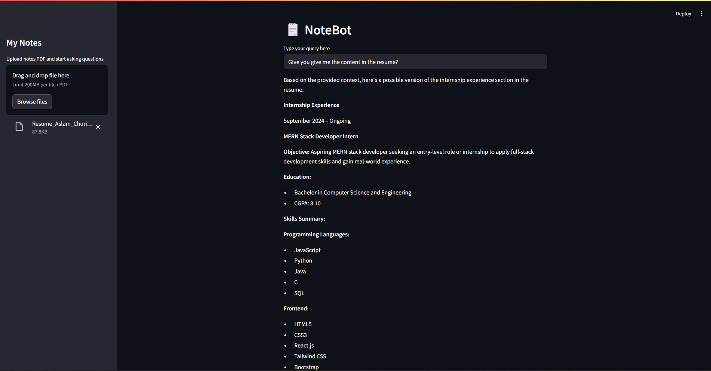
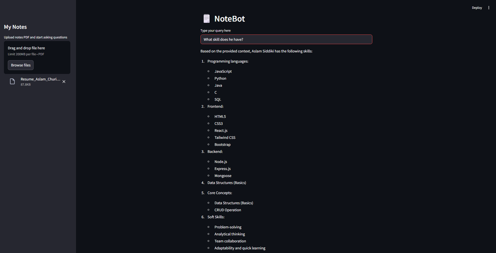

# 🗒️ NoteBot – AI-Powered PDF Chatbot

AI-powered PDF Question Answering chatbot built using **Streamlit, LangChain, Hugging Face, and FAISS**.

Upload your PDF notes and ask questions directly from the uploaded document. The chatbot retrieves relevant information and generates answers using AI.

🚀 **Live Demo:** [https://smartnotebot.streamlit.app](https://smartnotebot.streamlit.app)

💻 **GitHub Repo:** [https://github.com/Aslam-Siddiki/SmartNoteBot](https://github.com/Aslam-Siddiki/SmartNoteBot)

---

## 🚀 Features

* 📄 Upload PDF notes
* ✂️ Automatic text chunking
* 🧠 Generate embeddings with Hugging Face
* 🔍 Semantic search using FAISS
* 🤖 AI-powered answers using Llama 3.2
* ⚡ Interactive Streamlit interface

---

## 📷 Demo Screenshots

### Home Page



### Chat Interface



---

## 🛠️ Technologies Used

* Python 3.10+
* Streamlit
* LangChain
* Hugging Face (Llama 3.2 1B Instruct)
* FAISS
* Sentence Transformers (all-MiniLM-L6-v2)
* PyPDF
* dotenv

---

## 📂 Project Structure

```plaintext
MYCHATBOT/
│
├── .streamlit/
│   └── config.toml
├── assets/
│   ├── demo1.png
│   └── demo2.png
├── .env
├── .gitignore
├── app.py
├── requirements.txt
└── README.md
```

---

## ⚙️ Installation

### Clone Repository

```bash
git clone https://github.com/Aslam-Siddiki/SmartNoteBot.git
cd SmartNoteBot
```

---

### Create Virtual Environment

```bash
python -m venv .venv
```

Activate Environment
**Windows**

```bash
.venv\Scripts\activate
```

**Mac/Linux**

```bash
source .venv/bin/activate
```

---

### Install Dependencies

```bash
pip install -r requirements.txt
```

---

## 🔑 Environment Variables

Create `.env` file in the project root:

```env
HF_TOKEN=your_huggingface_token_here
```

Get your free token at [huggingface.co/settings/tokens](https://huggingface.co/settings/tokens)

---

## ▶️ Run Application

```bash
streamlit run app.py
```

Open:

```plaintext
http://localhost:8501
```

---

## 🧠 How It Works

1. Upload PDF
2. Extract text from PDF
3. Split text into chunks
4. Generate embeddings using Hugging Face
5. Store vectors in FAISS
6. Ask a question
7. Search relevant chunks
8. Generate answer using Llama 3.2

---

## 💬 Example Questions

* Summarize Chapter 1
* Explain this topic
* What are the important points?
* Give notes from this PDF
* List the key concepts

---

## 📦 Required Packages

```txt
streamlit
pypdf
langchain-core
langchain-community
langchain-text-splitters
langchain-huggingface
faiss-cpu
sentence-transformers
python-dotenv
```

---

## 🔮 Future Improvements

* Multiple PDF Upload
* Chat History
* Export Answers
* Voice Support
* Better UI

---

## 👨‍💻 Author

**Aslam Siddiqui**
MERN Stack Developer | AI Enthusiast

---

## 📄 License

This project was built for **learning purposes** as part of my journey into **Generative AI**.
Feel free to explore, learn, and get inspired. 🚀

---
